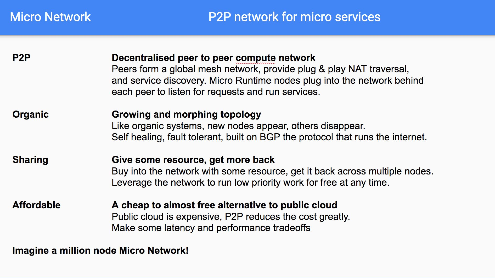

# Network

The micro network is a global p2p network for micro services.

## Overview

The power of collaborative development has mostly been restricted to trusted environments within organisations. 
These platforms unlock incredible productivity and compounding value with every new service added. They provide 
an always-on runtime and known developer workflow for engineers to collaborate on. This has largely been 
difficult to achieve outside of organisations. The micro network looks to solve this problem.

### Glossary of Terms

- **Backbone** - is the main network itself
- **Service** - is a process which runs in the network
- **Super Node** - is a host which runs the *backbone* of the network
- **Peer Node** - is a host which runs *services* in the network

## Release

Coming soon

## Contribute

Join the [slack](https://micro.mu/slack/) to discuss
