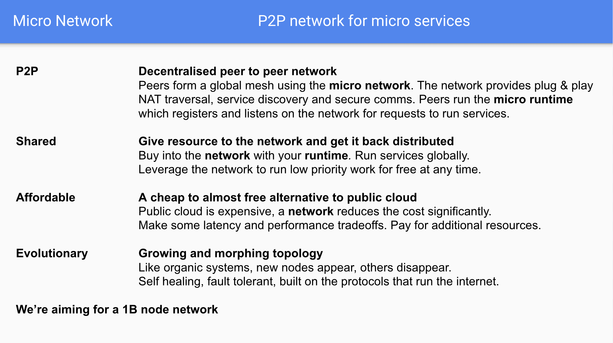
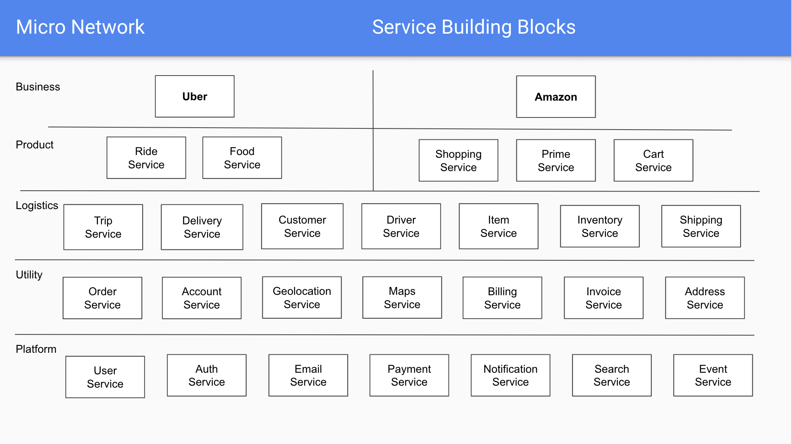

# Network

The micro network is a globally distributed network for micro services.

## Overview

The power of collaborative development has mostly been restricted to trusted environments within organisations. 
These platforms unlock incredible productivity and compounding value with every new service added. They provide 
an always-on runtime and known developer workflow for engineers to collaborate on. This has largely been 
difficult to achieve outside of organisations.

The micro network looks to solve this problem using a shared global network for micro services.

## Architecture

The network is a globally distributed network based on existing open source technology developed by micro and others. 
It provides the core requirements for collaborative service development at scale. This includes a common 
communication protocol, service discovery system, secure governance, service runtime and resource exchange model.

### High Level

At the high level we're using the open source micro toolkit as the foundation for an overlay network on the internet and a platform for microservices. 
Each user runs a local node which provides access to the network, a runtime for running services, a local http api gateway and web browser.

In future this design will include automatic data synchronization and backup for long term storage.

### Features

The network features a p2p compute runtime with a high bandwidth backbone. The network itself provides discovery, governance and a runtime. 
The design is such that what resource you put in, you get back distributed across the network. It's global and shared by default. You can 
buy more resource using tokens but you'll also get tokens for any requests made to your services.

The network is evolutionary and our goal is to reach 1B nodes with over 10x more services running on the network itself. 

### Services

The network provides a micro service runtime. Each service can be used as a building block for the next. 
This layering allows the creation of unique services on a foundation of hundreds of others. This is the microservice 
architecture pattern used by Google, Netflix, Uber and others which we're bringing to the masses.

Developers contribute services to the network and build on each others work.

### Identity

Most networks being bootstrapped require some form of identity system. Many of these start with base level asymmetric cryptographic 
using public/private key pairs. While we'll look to use these we believe this system is not enough. Anyone can participate in the 
network and anyone can generate a public/private key pair. Bad actors will likely cycle these and DDOS the network.

What we propose is a two layer identity system, with layer 1 as the public/private key pair (potentially using SPIFFE) and layer 2 
as a reputation based scoring system which over time solidifies your reputation and trusted identity in the network. The longer 
you exist in the network and participate the more likely it is we can identify you as a trusted party. New participants will be 
provided some base level access but must either pay to participate or stay on the network long enough to get further access.

The identity system will likely be as follows

- Layer 0 - the node connected to the network
- Layer 1 - the app providing a service to the network
- Layer 2 - the reputation scoring based on node + service

## Economics

Building such an architecture is good in theory but in practice requires network effects to drive its use, growth and ability to thrive. 
It is not enough to create an open network and ask developers to run peers in the network or contribute, there has to be some economic 
incentive to be part of it.

This is where [Token Economics](https://en.wikipedia.org/wiki/Token_economy) plays a role. Those contributing resources to the scale 
of the network and/or services on the network should be rewarded accordingly. Our goal is to build a native tokenized transaction 
system into the network to provide this resource usage model via exchange of tokens for services.

Here's a good explanation of [Token Economics](https://www.investinblockchain.com/token-economics/).

## Glossary of Terms

- **Network** - is the entire system for communication and coordination
- **Backbone** - is the core public high bandwidth main network itself
- **Super Node** - is a host which runs the *backbone* of the network
- **Peer Node** - is a host which runs *services* in the network
- **Service** - is a process which runs in the network and provides some utility
- **Token** - is an economic incentive used in exchange for the use of a service

## Release

Coming soon

## Contribute

Join the [slack](https://micro.mu/slack/) or [reddit](https://www.reddit.com/r/micronet/) community to discuss
