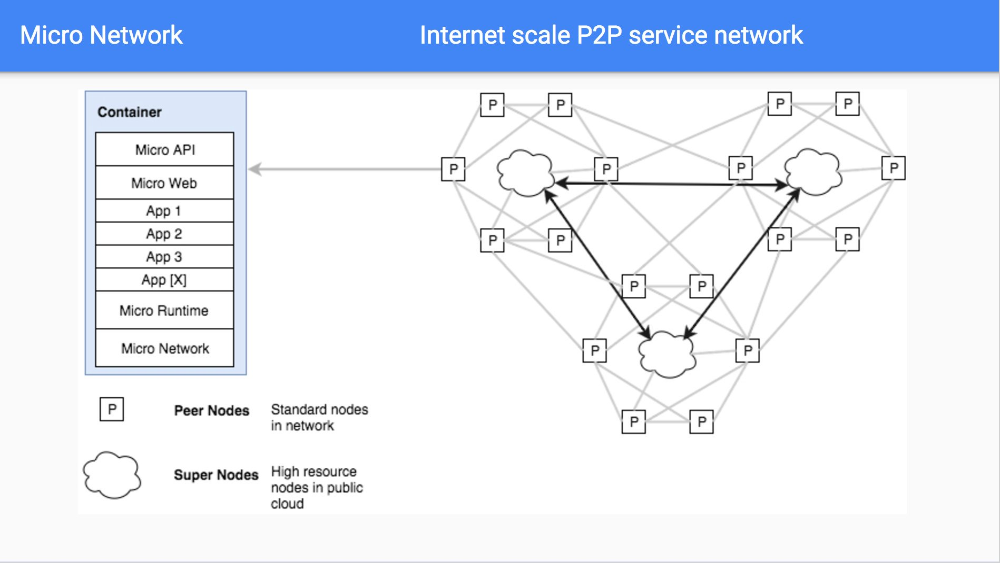

# Network

The micro network is a global p2p network for micro services.

## Overview

The power of collaborative development has mostly been restricted to trusted environments within organisations. 
These platforms unlock incredible productivity and compounding value with every new service added. They provide 
an always-on runtime and known developer workflow for engineers to collaborate on. This has largely been 
difficult to achieve outside of organisations. The micro network looks to solve this problem.

## Architecture

The network is a global p2p network based on existing open source technology developed by micro and others. 
It provides the core requirements for collaborative service development at scale. This includes a communication 
layer, service discovery system, secure governance, service runtime and resource exchange model.

### High Level

At the high level we're using the open source micro toolkit as the foundation for the network.

### Features

The network features decentralised communication network which provides discovery, governance and a runtime.

## Economics

Building such an architecture is good in theory but in practice requires network effects to drive its use, growth and ability to thrive. 
It is not enough to create an open network and ask developers to run peers in the network or contribute, there has to be some economic 
incentive to be part of it.

This is where [Token Economics](https://en.wikipedia.org/wiki/Token_economy) plays a role. Those contributing resources to the scale 
of the network and/or services on the network should be rewarded accordingly. Our goal is to build a native tokenized transaction 
system into the network to provide this resource usage model via exchange of tokens for services.

Here's a good explanation of [Token Economics](https://www.investinblockchain.com/token-economics/).

## Glossary of Terms

- **Network** - is the entire system for communication and coordination
- **Backbone** - is the core public high bandwidth main network itself
- **Super Node** - is a host which runs the *backbone* of the network
- **Peer Node** - is a host which runs *services* in the network
- **Service** - is a process which runs in the network and provides some utility
- **Token** - is an economic incentive used in exchange for the use of a service

## Release

Coming soon

## Contribute

Join the [slack](https://micro.mu/slack/) or [reddit](https://www.reddit.com/r/micronet/) community to discuss
